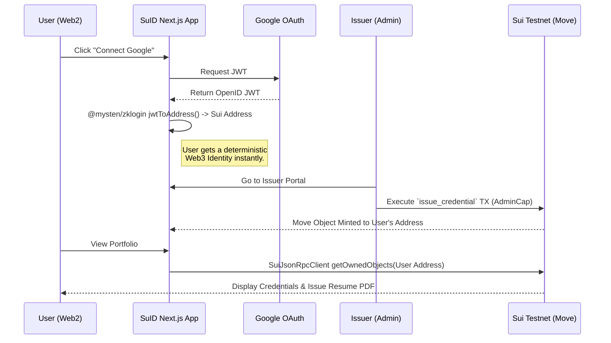

<div align="center">
  
  <h1>🏆 SuID: Immutable Proof Archive & Career Identity</h1>
  <p><strong>Built for the Sui Overflow 2026 Hackathon (Special - Walrus Track)</strong></p>
  
</div>

<br/>

[](https://sui-overflow-mu.vercel.app/) 
[](https://suivision.xyz/package/0x6929ada47f1d3a6ef94a73e0896a99cfc985cb5e878952032ed73592a423137a)

**SuID** is a decentralized, immutable proof archive for career credentials. Rather than simply uploading unverified PDFs to Web2 platforms, SuID leverages **Sui Objects** and concepts from **Walrus** to securely store, verify, and replay artifact provenance. By utilizing **zkLogin**, we abstract away the complexities of Web3, offering a seamless UX while guaranteeing absolute cryptographic authenticity and data reusability.

---

## 🚀 The Problem & Our Solution

**The Problem**: Career credentials and professional histories are currently fragmented, unverified, and prone to loss. Existing solutions are either closed walled-gardens (like Credly) or require massive UX hurdles (wallets, seed phrases) that deter mainstream adoption. More importantly, there is no standardized way to guarantee *artifact provenance*—proving exactly who issued a credential, when, and ensuring the data can be reliably retrieved and verified by any third party without relying on the original issuer's servers.

**The SuID Solution (Walrus / Proof Archive Approach)**: 
- **Immutable Artifact Provenance**: Credentials are not just text; they are immutable state changes recorded as Move Objects on Sui. This ensures permanent, tamper-proof storage of professional milestones.
- **Frictionless zkLogin**: Users authenticate with Google. No wallet extensions, no seed phrases. The onboarding is instant.
- **Verifiable Data Reusability**: Third parties (employers, audit systems) can independently query the Sui Testnet to restore, verify, and reuse the credential data at any time, eliminating the need for manual background checks.

---

## 🧪 How to Test (For Judges)

1. **Visit the Live App**: Go to [https://sui-overflow-mu.vercel.app/](https://sui-overflow-mu.vercel.app/)
2. **Login with zkLogin**: Click **"Connect Google"** in the top right. Watch as your Sui address is instantly derived via zkLogin.
3. **Mint a Credential (Issuer Portal)**:
   - Navigate to `/app/issuer` (Institution issuing route).
   - Enter your derived zkLogin Sui Address and an Event Name (e.g., "Sui Hackathon Winner").
   - Click **Issue Credential**. This triggers an actual transaction on the **Sui Testnet** using our deployed Move contract.
4. **View Portfolio**:
   - Go to `/app` (Portfolio page). 
   - You will see the credential you just minted loaded directly from the blockchain using the `@mysten/sui` v2 SDK.
5. **Issue Resume PDF**:
   - Go to `/app/resume` and click **"Generate Premium PDF"** to export your on-chain data into a beautifully formatted, resume-ready PDF.
6. **Verify On-Chain**:
   - Copy the Object ID of your credential.
   - Go to `/verify` and paste the ID. The app will fetch the live object data from the Sui Testnet, proving its authenticity.

---

## 🏗 Architecture Diagram



---

## 💻 Tech Stack

- **Frontend Framework**: Next.js 14 (App Router), React 19, Tailwind CSS v4
- **Sui Integration**: `@mysten/sui` v2 (JSON-RPC Client), `@mysten/zklogin`
- **Smart Contracts**: Sui Move (`suid::credential`)
- **Deployment**: Vercel (Frontend), Sui Testnet (Move Package)

---

## 🛠 Local Development

```bash
git clone https://github.com/dolf3131/sui-overflow-2026-suid.git
cd sui-overflow-2026-suid
npm install
npm run dev
```
*(Note: To test the Issuer Portal locally, you must provide `NEXT_PUBLIC_ADMIN_SECRET_KEY` in your `.env.local` file).*

## 📄 License
MIT
