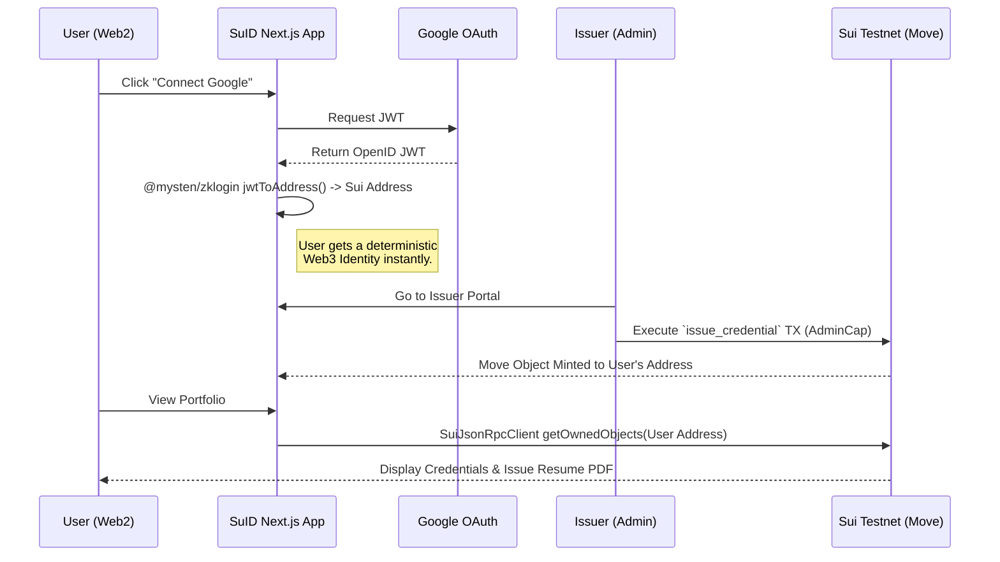

# 🏆 SuID: The Web3 Alternative to Credly

**Built for the Sui Overflow 2026 Hackathon**

[](https://sui-overflow-mu.vercel.app/) 
[](https://suivision.xyz/package/0x6929ada47f1d3a6ef94a73e0896a99cfc985cb5e878952032ed73592a423137a)

**SuID** is a fully on-chain, hybrid-event credential system that acts as a decentralized alternative to traditional Web2 certification platforms (like Credly). By leveraging **Sui's Object-Centric Model** and **zkLogin**, SuID completely abstracts away the complexities of Web3, offering a seamless Web2-like experience for end-users while ensuring absolute cryptographic authenticity.

---

## 🚀 The Problem & Our Solution

**The Problem**: Verifying resumes and credentials today is broken. Users upload unverified PDFs to LinkedIn or rely on centralized platforms like Credly that lock data into walled gardens. On the other hand, traditional Web3 NFT certificates require users to download wallet extensions, manage seed phrases, and pay gas fees—a massive barrier to entry.

**The SuID Solution**: 
- **User-Owned & Decentralized**: Credentials are natively owned by the user on the Sui blockchain as Move Objects.
- **Frictionless Onboarding**: Using Sui's **zkLogin**, users log in with Google. No wallet, no seed phrase.
- **Gasless Experience**: Issuers pay the gas to mint the credential. Users simply view and export their verified data.

---

## 🧪 How to Test (For Judges)

1. **Visit the Live App**: Go to [https://sui-overflow-mu.vercel.app/](https://sui-overflow-mu.vercel.app/)
2. **Login with zkLogin**: Click **"Connect Google"** in the top right. Watch as your Sui address is instantly derived via zkLogin.
3. **Mint a Credential (Issuer Portal)**:
   - Navigate to `/app/issuer` (Institution issuing route).
   - Enter your derived zkLogin Sui Address and an Event Name (e.g., "Sui Hackathon Winner").
   - Click **Issue Credential**. This triggers an actual transaction on the **Sui Testnet** using our deployed Move contract.
4. **View Portfolio**:
   - Go to `/app` (Portfolio page). 
   - You will see the credential you just minted loaded directly from the blockchain using the `@mysten/sui` v2 SDK.
5. **Issue Resume PDF**:
   - Go to `/app/resume` and click **"Generate Premium PDF"** to export your on-chain data into a beautifully formatted, resume-ready PDF.
6. **Verify On-Chain**:
   - Copy the Object ID of your credential.
   - Go to `/verify` and paste the ID. The app will fetch the live object data from the Sui Testnet, proving its authenticity.

---

## 🏗 Architecture Diagram



---

## 💻 Tech Stack

- **Frontend Framework**: Next.js 14 (App Router), React 19, Tailwind CSS v4
- **Sui Integration**: `@mysten/sui` v2 (JSON-RPC Client), `@mysten/zklogin`
- **Smart Contracts**: Sui Move (`suid::credential`)
- **Deployment**: Vercel (Frontend), Sui Testnet (Move Package)

---

## 🛠 Local Development

```bash
git clone https://github.com/dolf3131/sui-overflow-2026-suid.git
cd sui-overflow-2026-suid
npm install
npm run dev
```
*(Note: To test the Issuer Portal locally, you must provide `NEXT_PUBLIC_ADMIN_SECRET_KEY` in your `.env.local` file).*

## 📄 License
MIT
